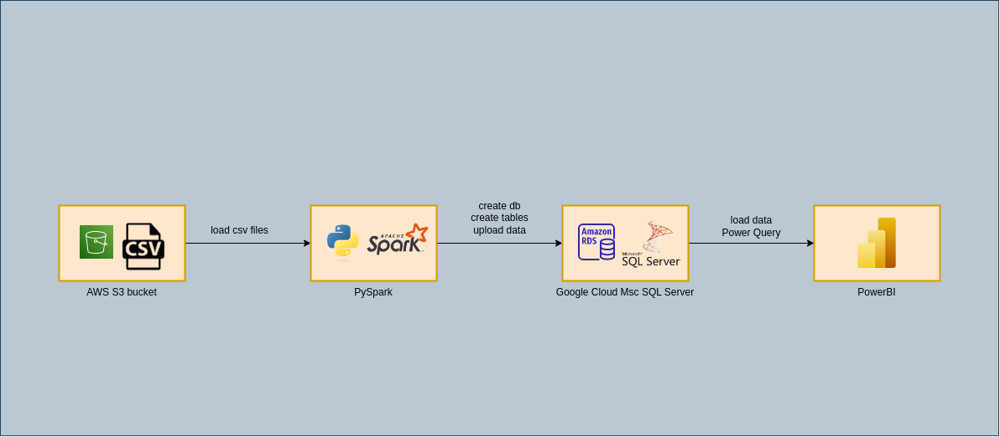

# Formula 1 Statistics Site
> This application shows statistics on Formula 1 racings.
> Power BI dashboard 📊 [_here_](https://app.powerbi.com/view?r=eyJrIjoiYWRhYjEwOGUtM2U2Yi00MTFhLWEwMGQtNjQ4N2E4ODMzYmQwIiwidCI6Ijc1NGU2OGMyLWM4NTctNDUzMC05MmMxLTRlNDQ3MWRjMDEyNCIsImMiOjl9).

## Table of Contents
* [General Info](#general-information)
* [Technologies Used](#technologies-used)
* [Features](#features)
* [Screenshots](#screenshots)
* [Setup](#setup)
* [Usage](#usage)
* [Project Status](#project-status)
* [Room for Improvement](#room-for-improvement)
* [Contact](#contact)


## General Information
- This project was created becouse I wanted to learn how to use PySpark. 
- I wanted to create database in SQL Server and create ETL process.
- I wanted learn basic Power BI function and DAX measurement.


## Technologies Used
- Python - version 3.11.2
- Pyspark - version 3.4.0
- Microsoft Power BI Desktop - 2.116.966.0 64-bit (April 2023)

## Features
List the ready features here:
- Creating source in S3 bucket, 
- Creating connection with S3 bucket,
- Making connection with DB,
- Creating database and tables,
- Transforming data with PySpark,
- Uploading data to SQL Server database,
- Making connection from Power BI to database,
- Loading data with Power Query,
- Making dashboard in Power Bi 📊 [_here_](https://app.powerbi.com/view?r=eyJrIjoiYWRhYjEwOGUtM2U2Yi00MTFhLWEwMGQtNjQ4N2E4ODMzYmQwIiwidCI6Ijc1NGU2OGMyLWM4NTctNDUzMC05MmMxLTRlNDQ3MWRjMDEyNCIsImMiOjl9)

## Screenshots



## Setup
For start application with docker you need [Docker](https://docs.docker.com/get-docker/) and [docker-compose](https://docs.docker.com/compose/install/).


## Usage
The application can be build from sources or can be run in docker.

##### Build from sources
```bash
$ # Move to directory
$ cd folder/to/clone-into/
$
$ # Clone the sources
$ git clone https://github.com/mateuszgua/formula1-statistics.git
$
$ # Move into folder
$ cd formula1-statistics
$
$ # Create virtual environment
$ python3 -m venv venv
$
$ # Activate the virtual environment
$ source venv/bin/activate
$
$ # Install requirements.txt file
$ pip install -r requirements.txt
$
```

## Project Status
Project is: in_progress


## Room for Improvement
Room for improvement:
- 

## Contact
Created by [@DevGua](https://devgua-portfolio.web.app/) - feel free to contact me!